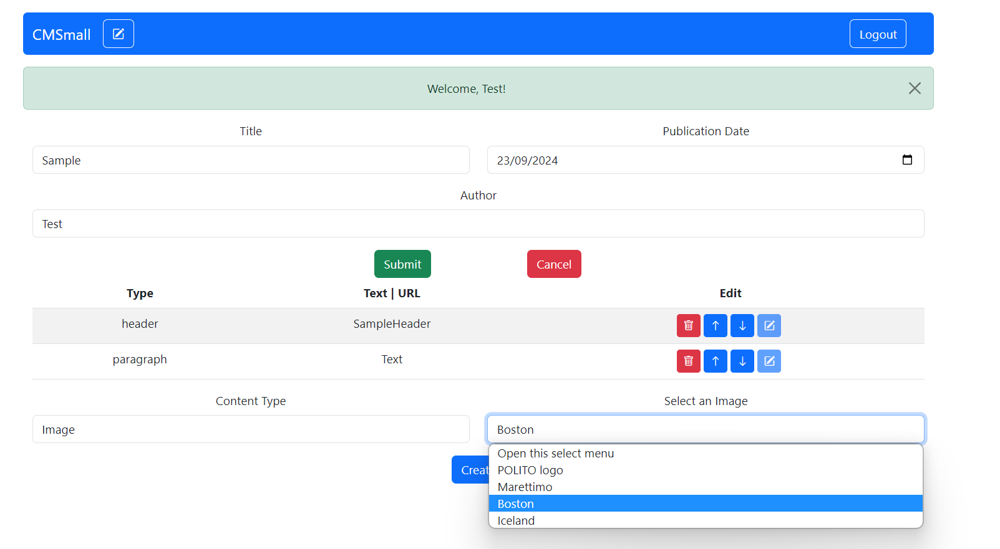
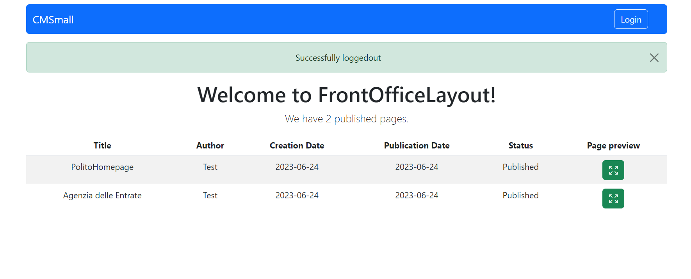
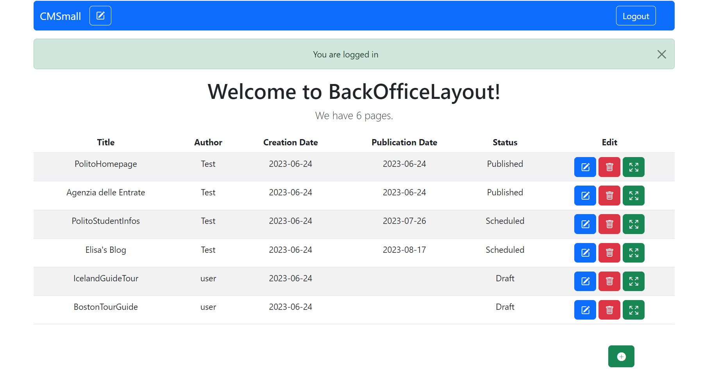

[](https://classroom.github.com/a/8AapHqUJ)
# Page #1: "CMSmall"
## Student: s309164 PALERMO BRUNO 

## React Client Application Routes

- Route `/`: redirect to `/pages`
- Route `*`: it shows a NOT FOUND page
- Route `/login`: it shows the login form
- Route `/pages`: (not logged in) it shows the FrontOffice table with published pages,  (logged in) it shows the BackOffice table with all pages 
- Route `/pages/add`: it shows the page form to add an additional page
- Route `/pages/:pageid/preview`: it shows the page with the relative contents
- Route `/pages/:pageid/edit`: it shows the page form to edit an existing page


## API Server

- GET `/api/pages`
  - request parameters and request body content: ```none```
  - response: 200 OK (success) or 500 Internal Server Error (generic error) or 401 Unauthorized (Not authenticated)
  - response body content:
    ``` 
    [
    {
      id: 3,
      authorid: 1,
      author: 'Test',
      title: 'PolitoHomepage',
      creationDate: '2023-06-24',
      publicationDate: '2023-06-24'
    },
    {
      id: 6,
      authorid: 1,
      author: 'Test',
      title: 'Agenzia delle Entrate',
      creationDate: '2023-06-24',
      publicationDate: '2023-06-24'
    },
    {
      id: 4,
      authorid: 1,
      author: 'Test',
      title: 'PolitoStudentInfos',
      creationDate: '2023-06-24',
      publicationDate: '2023-07-26'
    },
    ...
    ] 
    ```
- GET `/api/pages/publicated'` 
  - request parameters: ```none```
  - response: 200 OK (success) or 500 Internal Server Error (generic error)
  - response body content
    ```
    [
    {
      id: 3,
      authorid: 1,
      author: 'Test',
      title: 'PolitoHomepage',
      creationDate: '2023-06-24',
      publicationDate: '2023-06-24'
    },
    {
      id: 6,
      authorid: 1,
      author: 'Test',
      title: 'Agenzia delle Entrate',
      creationDate: '2023-06-24',
      publicationDate: '2023-06-24'
    }...
    ```
- GET `/api/pages/:id`
  - request parameters:```id: 6```
  - response: 200 OK (success) or 500 Internal Server Error (generic error) or 422 Unprocessable Entity (invalid body) or 404 Not Found (Page not found)
  - response body content
    ```

    {
    id: 6,
    authorid: 1,
    title: 'Agenzia delle Entrate',
    creationDate: '2023-06-24',
    publicationDate: '2023-06-24',
    contents: [
      {
        id: 121,
        pageid: 6,
        type: 'header',
        text: 'Paga i tuoi debiti',
        position: 1
      },
      {
        id: 122,
        pageid: 6,
        type: 'paragraph',
        text: 'Altrimenti chiedi un prestito ',
        position: 2
      }
    ]
    }
    ```
- POST `/api/pages/add`
  -  request body content: 
      ```
      {
        title: 'MarettimoTuristicWebsite',
        authorid: 1,
        creationDate: '2023-06-24',
        publicationDate: '2033-03-23',
        contents: [
          { id: 1, type: 'header', text: 'Marettimo', position: 1 },
          {
            id: 2,
            type: 'image',
            text: 'img_2.jpeg',
            position: 2
          }
        ]
      }
      ```
  - response: 200 OK (success) or 503 Service Unavailable (database error) or 422 Unprocessable Entity (invalid body) or 401 Unauthorized (Not authenticated)
  - response body content:
    ```
    {
      id: 7,
      authorid: 1,
      title: 'MarettimoTuristicWebsite',
      creationDate: '2023-06-24',
      publicationDate: '2033-03-23',
      contents: [
        { id: 127, pageid: 7, type: 'header', text: 'Marettimo', position: 1 },
        {
          id: 128,
          pageid: 7,
          type: 'image',
          text: 'img_2.jpeg',
          position: 2
        }
      ]
    }
    ```
- PUT `/api/pages/:id`
  - request parameters:`id: 3`
  - response: 200 OK (success) or 503 Service Unavailable (database error) or 422 Unprocessable Entity (invalid body) or 401 Unauthorized (Not authenticated) or 404 Not Found (Page not found)
  - request body content: 
    ```
      {
      id: '3',
      title: 'PolitoHomepage',
      authorid: 1,
      creationDate: '2023-06-24',
      publicationDate: '2023-06-24',
      contents: [
        {
          id: 113,
          pageid: 3,
          type: 'header',
          text: 'PolitoPage',
          position: 1
        },
        {
          id: 114,
          pageid: 3,
          type: 'image',
          text: 'img_1.jpeg',
          position: 2
        }
      ]
      }  
    ```
  - response body content: ```none```
- DELETE `/api/pages/:id`
  - request parameters: ```id: 7```
  - response: 200 OK (success) or 503 Service Unavailable (database error) or 422 Unprocessable Entity (invalid body) or 401 Unauthorized (Not authenticated or not authorized) or 404 Not Found (Page not found)
  - response body content: ```none```
- GET `/api/images`
  - request parameters: ```none```
  - response: 200 OK (success) or 500 Internal Server Error (generic error)
  - response body content: 
    ```
    [
    { id: 1, name: 'POLITO logo', path: 'img_1.jpeg' },
    { id: 2, name: 'Marettimo', path: 'img_2.jpeg' },
    { id: 3, name: 'Boston', path: 'img_3.jpeg' },
    { id: 4, name: 'Iceland', path: 'img_4.jpeg' }
      ]
    ```
- PUT `/api/titles`
  - request paramters: ```none```
  - request body: ```{ title: 'CMSmall' }```
  - response: 200 OK (success) or 503 Service Unavailable (database error) or 422 Unprocessable Entity (invalid body) or 401 Unauthorized (Not authenticated) or 404 Not Found (Page not found)

  - response body content : ```{ title: 'CMSmall' }```

- GET `/api/titles`
  - request parameters: ```none```
  - response: 200 OK (success) or 500 Internal Server Error (generic error)
  - response body content: ```{ title: 'CMSmall' }```

- GET `/api/users`
  - request parameters: ```none```
  - response: 200 OK (success) or 500 Internal Server Error (generic error) or 401 Unauthorized (Not authenticated or Not authorized)

  - response body content: 
  ```
    [
    { id: 0, username: 'user', role: 'user' },
    { id: 1, username: 'Test', role: 'admin' },
    { id: 2, username: 'user1', role: 'user' },
    { id: 3, username: 'user2', role: 'user' }
    ]
  ```
- POST `/api/sessions`
  - request body
    ```
      {
        username: "test@test.it"
        password: "password"
      }
    ```
  - response: 200 OK (success) or 401 Unauthorized (Not authenticated)

  - response body content:
    ```
    {
     id: 1,
     email: 'test@test.it',
     username: 'Test',
     role: 'admin' 
    }
    ```
- GET `/api/session/current`
  - request parameters and request body content: ```none```
  - response: 200 OK (success) or 401 Unauthorized (Not authenticated)
  - response body content:
  ```
    {
     id: 1,
     email: 'test@test.it',
     username: 'Test',
     role: 'admin' 
    }
  ```
- DELETE `/api/session/current`
  - request parameters and request body content: ```none```
  - response: 200 OK (success) or 401 Unauthorized (User is not logged in)
  - response body content: ```none```


## Database Tables

- Table `users` - contains (id, email, username, role, hash, salt)
- Table `titles` - contains (id, title)
- Table `pages` - contains (id, authorid, title, creationdate, publicationdate)
- Table `contents` - contains (id, pageid, type, text, position)
- Table `images` - contains (id, name, path)

## Main React Components

- `Page` (in `PageComponent.jsx`): A page that shows the preview of the page with its content
- `LoginForm` (in `AuthComponents.js`): A form where to insert email and password to login
- `PageForm` (in `PageFormComponent.js`): A form where to insert infos of a page to create while logged in
- `ContentTable` (in `PageFormComponent.jsx`): displays a preview of the content created so far before the submission in the page form while logged in
- `NavHeader` (in `NavbarComponents.jsx`): A navbar showing the title of the website that can be edited in case of being admin and login/logout link to navigate to the LoginForm
- `FrontOfficeLayout` (in `FrontOfficeComponents.jsx`): A page that shows publicated pages to all non-logged in user
- `BackOfficeLayout` (in `BackOfficeLayout.jsx`): A page that shows pages to all logged in user with possibility of creating/preview a page and edit/remove a page in case of owner/admin of the page.
- `ContentForm` (in `ContentForm.jsx`): A form where to insert infos of a content relative to a page while logged in

## Screenshot
### Creation of a Page

### Front Office Layout

### Back Office Layout


## Users Credentials


  I assumed that passwords must have a minimum length of 6 characters and has different salts and conseguently different hash

|      username       |   password    |
| :-----------------: | :-----------: |
| test@test.it | password |
| user@user.it | password |
| user1@user.it | password |
| user2@user.it | password |
